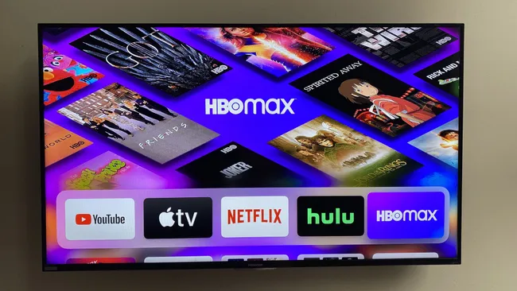

# Movie Recommendation System
# by Group 1



## Project Overview
This project was developed for a burgeoning video streaming platform aiming to compete with industry giants like Netflix and Disney+. The primary goal is to **increase user retention** and **reduce churn** by providing a highly personalized viewing experience.

Using the **MovieLens** dataset (100k+ ratings), we built a multi-stage recommendation engine capable of handling users at every stage of their lifecycle—from brand-new signups to long-term "resident" viewers.

## The Router Logic
To maximize retention, the system doesn't just use one model. It uses a **Router** to select the best algorithm based on user history:

| User Stage | Interaction Count | Strategy Used |
| :--- | :--- | :--- |
| **New / Near-Cold** | 0 - 10 ratings | **Popularity-based** + **Content-based** (TF-IDF) |
| **Early User** | 10 - 50 ratings | **Hybrid Model** (SVD + TF-IDF Weighted) |
| **Resident User** | 50+ ratings | **Collaborative Filtering** (Optimized SVD) |

## Key Features
* **Hybrid Scoring:** Combines latent factor analysis (SVD) with item-feature similarity (TF-IDF on genres and user tags) using an $\alpha$-weighted formula.
* **Cold-Start Mitigation:** Uses popularity and content-based filtering to ensure new users see relevant content immediately.
* **Advanced Evaluation:** Models are evaluated using **RMSE** (rating accuracy) and **NDCG@10** (ranking quality).
* **Interactive Deployment:** A Streamlit dashboard allowing users to input their preferences and receive real-time recommendations.

## Tableau
[Interactive Movie Recommendation Dashboard](https://public.tableau.com/app/profile/yvonnie.wanyoike/viz/InteractiveDashboardforMovieRecommendationSystem/BusinessProblem_Page_1)

## Evaluation Results
According to our evaluation, **Collaborative Filtering (SVD)** emerged as the superior engine for this dataset.

| Model | NDCG@10 | Best For |
| :--- | :--- | :--- |
| **SVD** | **0.90+** | Active users with history |
| **Hybrid** | **0.58+** | Early users needing a mix |
| **Content-Based** | **0.52** | Discovery of niche/new items |

The superior performance of collaborative filtering adds up given the structure of the dataset. With over 100,000 ratings across hundreds of users, the interaction matrix is sufficiently dense for matrix factorization methods to learn stable latent factors. In contrast, content-based filtering is constrained by limited content richness in movie metadata (genres and sparse tags)

## Project Structure
```text
├── data/                   # Raw MovieLens CSVs & Exported Tableau datasets
├── movies.ipynb              # Complete CRISP-DM analysis & Modeling
├── app.py                  # Streamlit frontend
├── convert_model.py           # Facilitate cloud deployment
├── recommender_model.pkl   # Serialized SVD model & TF-IDF matrix
├── slides/                # Non-technical presentation
├── requirements.txt
└── README.md
```

## Installation
* git clone this repo
* cd to the repo folder
* pip install -r requirements.txt
* streamlit run app.py

Here is the live [link](https://bxjl9dnv7rze79ax2nmdbr.streamlit.app/)
```

## Tableau
https://d.docs.live.net/204a22a8a289afcf/Documents/Tableau link
